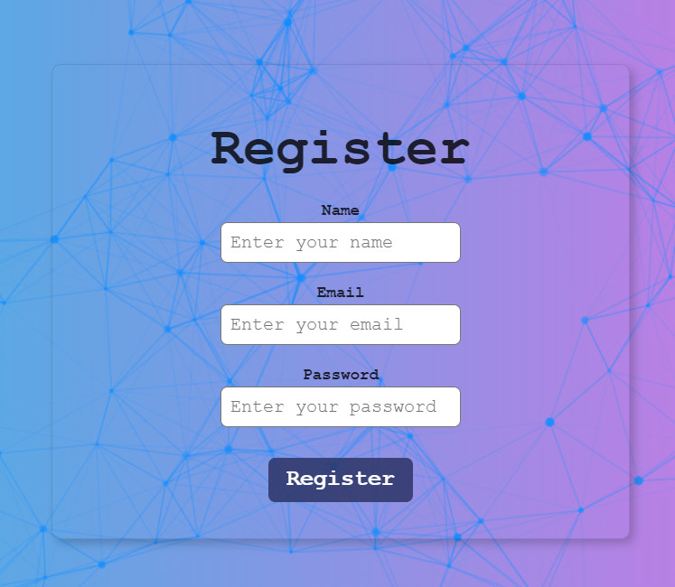
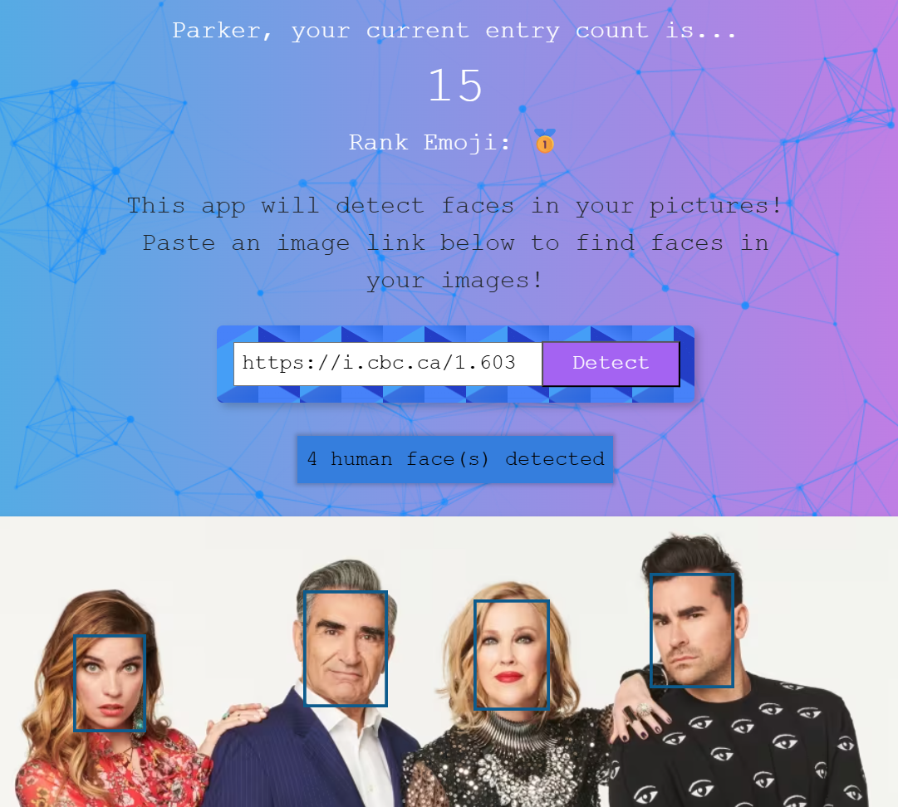

<h1 align='center'>SmartBrain Project 
Live Site: https://parkers-smartbrain.fly.dev/
</h1>

This is the Zero to Mastery Complete Web Developer's course final project - with some added improvements!

<h1>How to Use:</h1>

You can use the following test login information if you'd just like to test the app without creating a new profile:
 
Email: a@gmail.com
 
Password: 123
 

 

**Please note: Site may take a few seconds to initially load due to Bcrypt password verification 

Or, click on the 'Register' button and create your own login details to use instead 

 

Once logged in, copy and paste an image url from the web into the search input field, then click the 'DETECT' button to run the Face Detection API
 

 

Each time you upload an image, your entry count is increased by +1
 

## Description

A React app that detects and highlights faces in web images. Built with <b>React.js</b>, <b>Node.js</b>, <b>Express</b>, <b>Bcrypt</b>, <b>PostgreSQL</b>, <b>Tachyon CSS</b>, <b>Clarifai Face Detection API</b>, deployed on <b>Fly.io</b>
 

<i>A huge thanks to Andrei Neagoie for creating [Zero To Mastery Complete Web Developer Course](https://zerotomastery.io/courses/coding-bootcamp/) and the entire Zero To Mastery platform to help encourage new developers like myself to pursue their passions!</i>
 

This project was not entirely a code along, as I had to overcome a few challenges:
 
<li>The Clarifai REST API integratation. Ran into numerous issues with outdated code and documentation. Was also able to use Clarifai model to detect multiple faces, not just one</li>
<li>Deployment - ZTM course deployed to Heroku, but since free tier no longer exists, had to troubleshoot with other hosting services for server, database, and front-end app deployment</li>
<li>Resolved numerous issues related to using a Windows OS vs Mac (i.e. PATH errors)</li>
<li>Moving API calls from front-end to back-end for security</li>
<li>Setting up ENV variables properly on the server</li>
<li>Learned several new technologies: Node.js, Express, Bcrypt, PostgreSQL, Knex.js</li>
<li>Challenged myself by using ES6 syntax for Node.js, despite all ZTM videos using commonJS (Back-end is 99% ES6 syntax)</li> 

Possible Future Improvements:

<li>Store submitted images for a gallery view</li>
<li>Edit profile info & delete profile</li>
<li>Display a loading spinner while logging in</li>

## Features
<li>Multi-Face Detection using Clarifai Face Detection API Model
</li>
 

<li>User profiles, stored with a PostgreSQL Database hosted on Fly.io
</li>
 

<li>Responsive layout using Flexbox
</li>
 

<li>TS Particles for background animation
</li>
 

<li>Parallax Tilt for interactive site logo
</li>
 

<li>Form Validation
</li>
 

<li>Custom site favicon that supports apple and android devices too
</li>
 

<li>Bcrypt user password encryption/decryption to/from PostgreSQL/Fly.io Database
</li>
 

  
