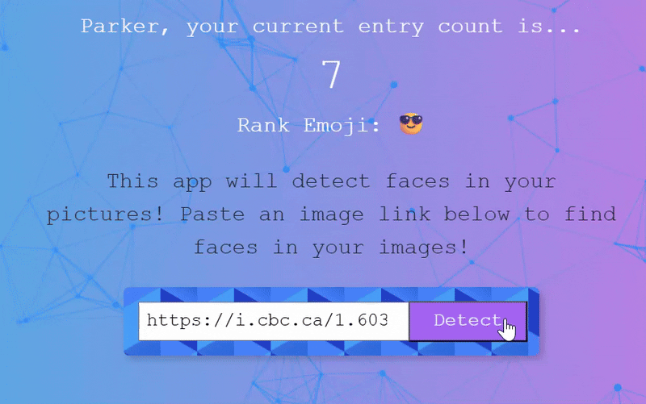
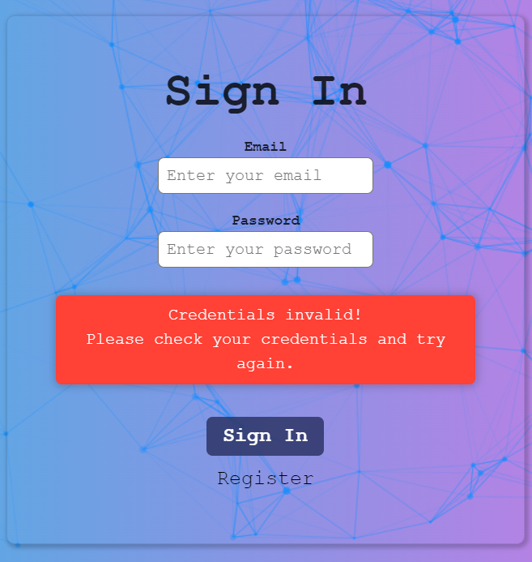
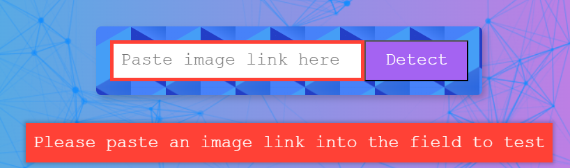
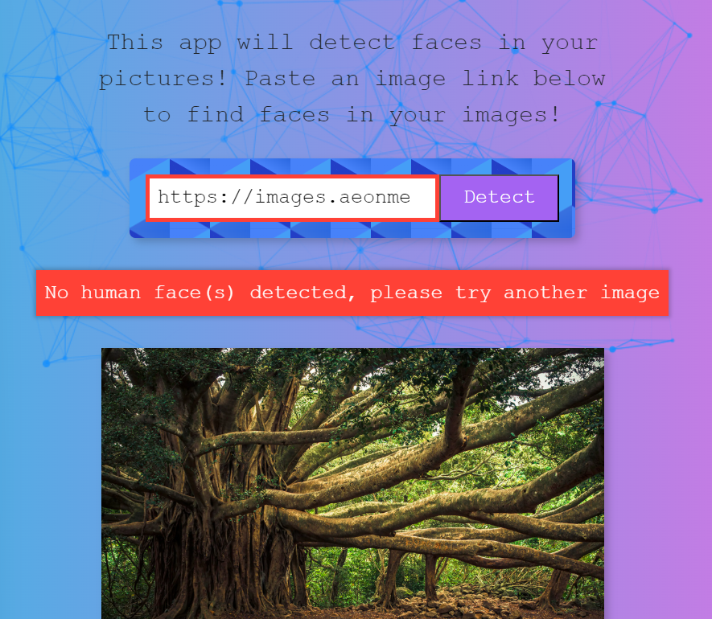

<h1 align='center'>SmartBrain Project 🧠 
Live Site: https://parkers-smartbrain.fly.dev/
</h1>

# Description

A React app that detects and highlights faces in web images. Built with <strong>React.js</strong>, <strong>Node.js</strong>, <strong>Express</strong>, <strong>Bcrypt</strong>, <strong>PostgreSQL</strong>, <strong>Redis</strong>, <strong>JWT (session management)</strong>, <strong>AWS S3 + Lambda</strong>, <strong>Bootstrap</strong>, <strong>Tachyon CSS</strong>, and <strong>Clarifai Face Detection API</strong>, deployed on <strong>Fly.io</strong>

<h1>How to Use:</h1>

Use the following test login information if you'd like to test the app without creating a new profile:
 
Email: <strong>a@gmail.com</strong>
 
Password: <strong>123</strong>
 

 

**Please note: Site may take a few seconds to initially sign in due to Bcrypt password verification 

Or, you can register a new account. <strong>Note: please use test login info from above, to avoid overloading the database memory. Thanks!</strong> 

 

Once logged in, copy and paste an image url from the web into the search input field, then click the 'Detect' button to run the Face Detection API

 

Each time you upload an image, your entry count is increased by +1. You also get an emoji rank that changes with each image submission 😎

You can also view and update your profile information

Including your profile picture!

## Features
<li>Multi-Face Detection using Clarifai Face Detection API Model
</li>
 

<li>User profiles, stored with a PostgreSQL Database, hosted on Fly.io
</li>
 

<li>JWT session management, with tokens stored in Redis temporarily
</li>
 

<li>Tokens removed during sign-out, so re-authentication is required
</li>
 

<li>Responsive layout using Flexbox
</li>
 

<li>TS Particles for background animation
</li>
 

<li>Parallax Tilt for interactive site logo
</li>
 

<li>Form Validation & Error Messages
</li>
 

<li>Custom site favicon
</li>
 

<li>Bcrypt user password encryption/decryption to/from PostgreSQL/Fly.io Database
</li>
 

<li>Mobile-friendly
</li>
 

<h3>Technical challenges I overcame:</h3>
<li>With Clarifai REST API integration, had numerous issues with outdated code and documentation. Was also able to instruct Clarifai model to detect multiple faces, not just one</li>
<li>Troubleshooted with free hosting services for server, databases, and front-end app deployment</li>
<li>Resolved numerous issues related to using a Windows OS vs Mac (i.e. PATH errors)</li>
<li>Moved API calls from front-end to back-end for security</li>
<li>Setting up ENV variables properly on the server for both local development and production</li>
<li>Learned several new technologies: Node.js, Express, Bcrypt, PostgreSQL, Redis, Docker, AWS, JWT, Knex.js</li>
<li>Challenged myself by using ES6+ syntax for Node.js (Back-end is 100% ES6+ syntax)</li>

<h3>Possible Future Improvements:</h3>
<li>Store submitted images in a gallery view</li>
<li>Allow users to upload local images for face detection API</li>
<li>Display a loading spinner while logging in</li>

<h1><a href='https://github.com/ProfoundlyParker/SmartBrain--front-end'>View Back-End Repository</a></h1>

  
